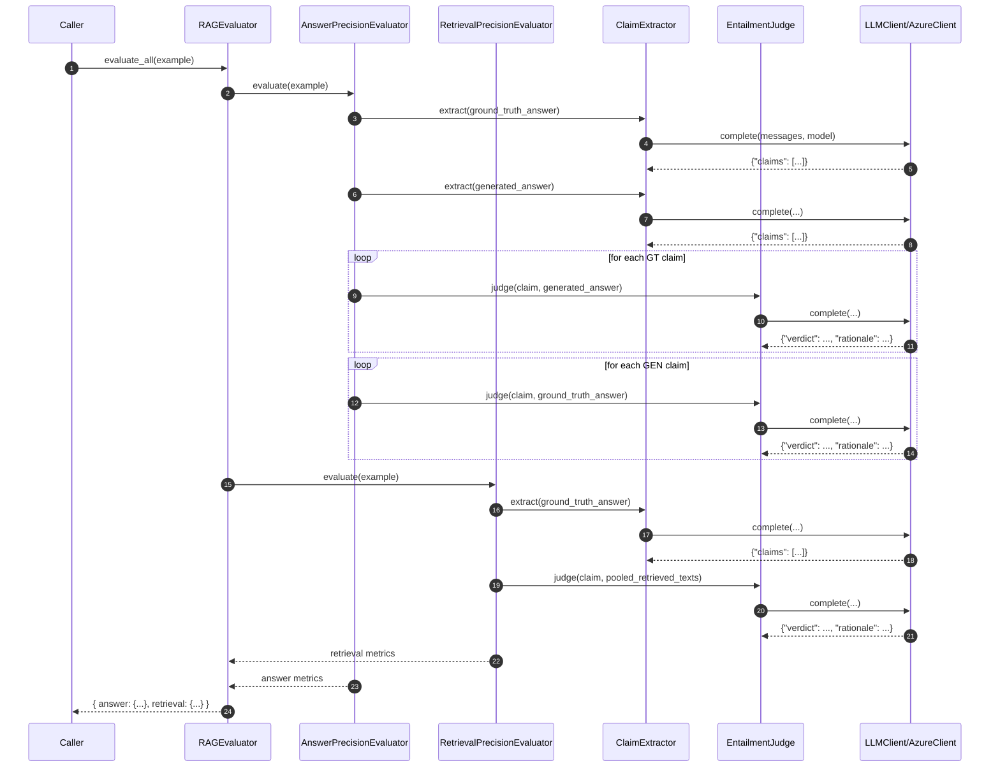

# AI-Agent

Repository where I document the progress of my AI-agent prototpye. 
> Version: 0.1 • Status: Draft

---
# Repo Structure
```
AI-Agent-POC/
├── data/
│   └── RAG_docs/
└── src/
    ├── agent/
    ├── rag/
    └── rag_eval/
```
To run the repo on your local machine, clone it and install the packages from the requirements.txt
Make sure to set up your own .env-file at the root-level, which contains:  
- your OpenAI API-key (or that for your LLM of choice - which LLM you use can be swapped out)
- your OpenAI-endpoint
- your OpenAI model
- a password for the Wallet
---
## Purpose

1) Create a prototype for an AI-agent that can autonomously call tools and has integrated RAG-functionality.
2) Evaluate Retrieval-Augmented Generation (RAG) with regard to **retrieval precision** and **answer precision**. 

---
## Core Components & Responsibilities
- **food_agent**: A loop that implements a food ordering agent which can access various tools such as checking the food wallet, topping up the food wallet or ordering a meal, as well as RAG to "read" the menus.
- **Wallet**: a class that implements the food wallet for the agent. Comes with *get_balance* and *top_up*-method
- **order_food (helper**): enables agent to simulate the placement of a food order. 
- **LLMClient (Protocol)**: Defines `complete(messages, *, model, temperature, max_tokens) -> str`. Ensures backend swapability and compile-time safety with mypy.
- **AzureClient (Adapter)**: Implements `LLMClient`. Forwards `chat.completions.create` with `response_format={"type":"json_object"}` to enforce structured outputs.
- **ClaimExtractor**: LLM prompt that converts input text into atomic, verifiable claims. Always returns a list.
- **EntailmentJudge**: LLM prompt for NLI classification (`supported | contradicted | not_enough_info`) with a rationale.
- **AnswerPrecisionEvaluator**: Computes
  - *GT claim recall*: fraction of ground-truth claims supported by the generated answer.
  - *Hallucination precision*: fraction of generated claims supported by the ground-truth.
- **RetrievalPrecisionEvaluator**: Computes
  - *Evidence coverage* over pooled context.
  - *Doc precision*: fraction of retrieved docs that support at least one GT claim.
- **RAGEvaluator**: Thin coordinator that wires extractor + judge into both evaluators and exposes `evaluate_all()`.

---

## Interaction (Sequence for `evaluate_all`)



